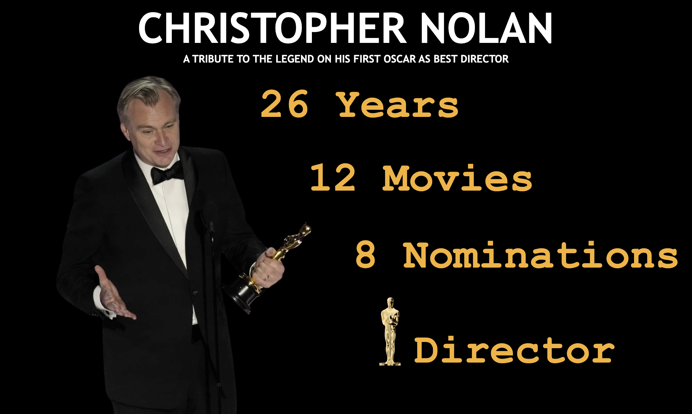

# A Tribute to the Legend - CHRISTOPHER NOLAN

This repository contains a Tableau dashboard focused on Christopher Nolan, created as part of the Tableau Data+Movies challenge and inspired by his recent win as Best Director at the Oscars 2024.

## Dashboard Overview

The dashboard provides insights into Christopher Nolan's career in the film industry. It includes visualizations on various aspects such as:

- Box office performance of his movies
- Audience ratings and reviews
- Cast and Crew
- Awards and nominations

## Files Included

- `Christopher_Nolan.twbx`: Tableau packaged workbook file containing the interactive dashboard.
- `data.csv`: Dataset used for creating the dashboard.
- `Snapshot.png`: Screenshot of the dashboard for a quick preview.

## Accessing the Dashboard

You can interact with the dashboard directly on Tableau Public:

[View Christopher Nolan Tableau Dashboard](https://public.tableau.com/app/profile/ajay.vishnu.addala/viz/ATributetoChristopherNolanDataPlusMoviesOscars_17102844550300/Dashboard1)   <!-- Add the Tableau Public link here -->

## Instructions for Usage

1. Download the `Christopher_Nolan_Dashboard.twbx` file.
2. Install Tableau Desktop or use Tableau Public.
3. Open the `.twbx` file in Tableau to explore the dashboard interactively.

## Contributions

Contributions to enhance the dashboard or improve the dataset are welcome. Please fork the repository, make your changes, and open a pull request.

## Credits

This dashboard project was created by [Ajay Vishnu Addala]. 
